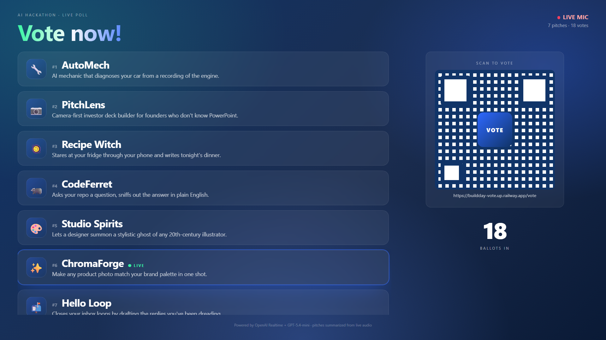
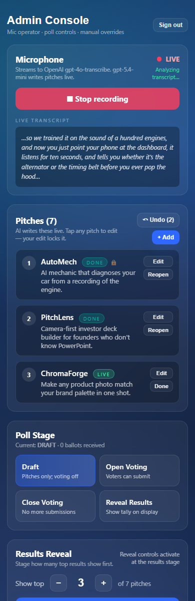
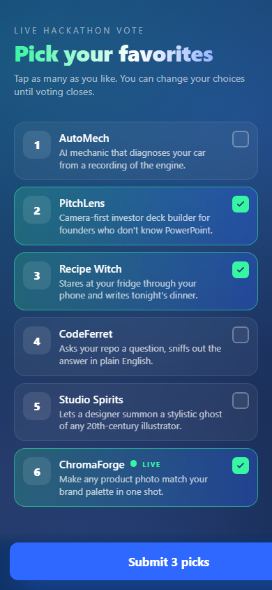
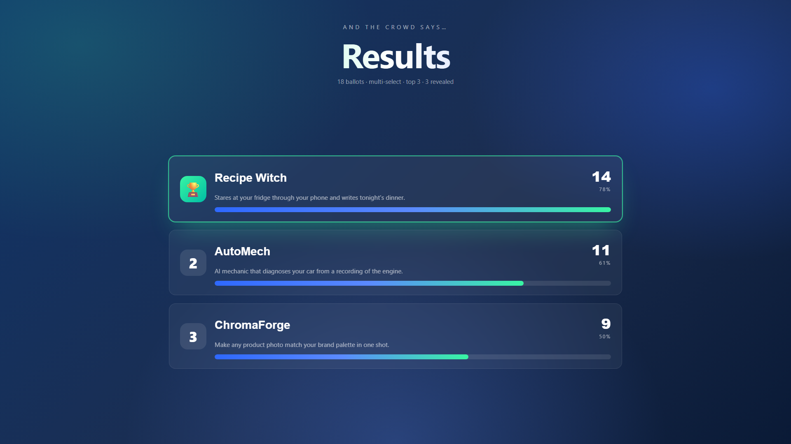

# Running an event with Buildday Vote

A runbook for the person operating the vote at a live hackathon. Read this once before the event, then keep it open in a tab during.

If you haven't deployed the app yet, do that first: see the [Quick start](../README.md#quick-start) and [Deploying to Railway](../README.md#deploying-to-railway) sections of the README.

---

## What you need

- A **projector laptop** with a browser. Will show `/display`.
- An **admin phone** with a browser and a usable microphone. Will run `/admin`. The mic operator holds this.
- The **`ADMIN_TOKEN`** you set as an env var (see [README → Configuration](../README.md#configuration)).
- The **deployed URL** (e.g. `https://your-app.up.railway.app`). The audience will scan a QR pointing at `/vote` on this URL.
- Stable Wi-Fi at the venue. Every device needs to reach the server.

## Two-minute pre-flight (do this the day before)

1. Open the deployed `/display` URL on the projector laptop. You should see "Listening for pitches…" or "Ready when you are."
2. Open `/admin` on the admin phone. Paste your `ADMIN_TOKEN`. You should land on the admin console.
3. Tap **Start recording**. Grant mic permission. The status badge should switch to a red **LIVE**.
4. Say something into the mic ("This is a test pitch about an AI mechanic that listens to your engine…"). Within ~30 seconds a pitch should appear on the display.
5. Tap **Stop recording**. Tap the pitch in the admin and **Delete** it.
6. You're set. If any of those steps failed, see [Troubleshooting](#troubleshooting) before the event.

> If the venue Wi-Fi is bad, a backup is to run the server locally on your laptop and let people connect over the venue Wi-Fi using your laptop's local IP. See [README → Other hosts](../README.md#other-hosts).

---

## How the show flows

The poll moves through four stages, controlled from the **Poll Stage** card on the admin. Each stage changes what the display and voter pages show.

| Stage | Display shows | Voter page shows | Analyzer | Mic |
|---|---|---|---|---|
| **Draft** | Live pitch list. "Listening for pitches…" status. No QR. | "Voting hasn't opened yet" with pitches so far. | Running every 8-30s. | On (when recording). |
| **Open** | Pitch list + QR + live ballot counter. | Voting ballot. Multi-select. | Off. Pitch list frozen. | Off. Locked. |
| **Closed** | Pitch list + "Tallying votes…" | "Voting is closed" with the voter's own picks. | Off. | Off. |
| **Results** | Bar chart, staged reveal. | Results, staged reveal. Voter's own picks marked. | Off. | Off. |

A few rules baked into those transitions:

- **Going to Open or Draft wipes all ballots.** The admin confirms first if any ballots exist.
- **Going to Open, Closed, or Results locks the pitch list.** Any in-progress pitches flip to completed, and `locked` is set on every pitch so the analyzer can't change them.
- **Going to Open also turns off the mic.** The admin's browser sees this via SSE and tears down its WebRTC peer.
- **Entering Results from any other stage** resets the reveal cursor to 0 (placeholders, nothing shown yet) and clears "Show remaining."

---

## Step-by-step walkthrough

### 1. Set up the room

- Plug the projector laptop in. Open the deployed `/display` URL. Make it fullscreen (`F11` in most browsers).
- Hand the mic operator the admin phone. Have them open `/admin` and unlock with `ADMIN_TOKEN`.
- Put the admin phone on Do Not Disturb so notifications don't pop up over the admin UI during pitching.
- Test that the projector laptop can reach the deployed URL (no captive portal blocking it).

### 2. Pitching (poll stays in Draft)

The MC starts pitching. The mic operator taps **Start recording** in the admin and grants mic permission. The status badge goes red **LIVE**.

What's happening server-side:

- The admin phone streams audio over WebRTC straight to OpenAI Realtime.
- Completed transcript chunks come back, get POSTed to the server.
- Every 8-30 seconds the server sends the last 5 minutes of transcript to `gpt-5.4-mini` and asks for the current pitch list back.
- New pitches show up on the display and on the admin within ~30 seconds of being introduced.

**What the mic operator does during pitching:**

- Mostly nothing. Watch the admin's pitch list. The AI is doing the work.
- If a pitch title is wrong (proper noun, acronym, brand name the AI got phonetic), tap the pitch, tap **Edit**, type the right name, **Save**. A 🔒 icon appears: the analyzer won't touch it again.
- If the AI spawns a duplicate pitch, or interprets Q&A as a new pitch, tap **Delete**. (See [Deleting a pitch cleanly](#deleting-a-pitch-cleanly) below.)
- If you delete by accident, **Undo** in the top right rolls back the last pitch/vote change. Up to 50 changes are stored.
- **Don't tap Stop recording between pitches.** The server already handles silence, applause, and pauses. Restarting the mic forces a fresh WebRTC handshake with OpenAI that drops a few seconds of audio.

### 3. Open voting

When pitching is over and the MC is wrapping up:

1. In the admin, tap **Open Voting**.
2. The mic shuts off automatically.
3. The pitch list locks and any in-progress pitch flips to "done."
4. The QR code and a running ballot counter appear on the display.

  

Tell the audience to scan the QR. The vote page works on any phone with a camera; no app install.

Voters can:

- Tap as many pitches as they want. It's multi-select.
- Re-submit until voting closes. The Submit button changes to "✓ Saved — tap again to update."
- Watch live confetti and twinkles on the display when they tap a pitch (the display animates each tap).

**Late arrivals are fine.** A voter scanning the QR 5 minutes into open voting still gets the full ballot. They just have less time to vote before you close it.

### 4. Close voting

When you're ready to lock in the result:

1. In the admin, tap **Close Voting**.
2. The QR disappears from the display. The voter pages flip to "Voting is closed" with each voter's own picks listed.
3. No new ballots can be submitted. Existing ballots are kept.

Closing is optional. You can also jump straight to **Reveal Results** and it will close voting implicitly. Closing is useful if you want a pause between voting and the reveal.

### 5. Reveal results

In the admin, tap **Reveal Results**. The display switches to the bar chart with every slot hidden behind a placeholder card. Now you drive each reveal manually from the **Results Reveal** panel.

Controls in the **Results Reveal** panel:

- **Show top N (stepper).** How many top pitches to feature one by one. Default is 3. Bumping this up adds more placeholders to the display.
- **Reveal #N.** Reveals the next card in the top group, starting from the winner. The button name is the click count: first click is "Reveal #1" and shows rank 1, second click is "Reveal #2" and shows rank 2, etc.
- **Show remaining.** Once you've revealed every slot in the top group, this button reveals everyone below the top in a single cascading burst. Use it if you want the audience to see the full standings; skip it if you want to keep the bottom of the pack hidden.
- **Reset reveal.** Hides everything back to placeholders. Useful if you want to redo the reveal.

**How to pace the reveal:**

1. Set "Show top" to 3 (or however many you want).
2. MC announces the winner. Tap **Reveal #1**. The top slot fills in with the rank-1 card, glowing mint with a trophy tile. Confetti fires.
3. MC moves to "and in second place…" Tap **Reveal #2**. The second slot fills in.
4. "And rounding out the top three…" Tap **Reveal #3**. Third slot fills in.
5. (Optional) "And here's how everyone else did…" Tap **Show remaining**. The pitches below the top-N reveal in a cascade.

Reveals go top-down (winner first, then 2nd, then 3rd). There's no built-in way to flip this to a bottom-up drumroll order without a code change.

**Tied results.** The app uses standard competition ranking (1, 2, 2, 4). If the top N would split a tie, the system silently expands the top group so co-N's stay together. You'll see a "showing X (ties grouped)" note in the admin if this happens. The display will show the same rank number on both rows; only the row revealed with `rank === 1` gets the trophy tile.

---

## Reference: every admin control

### Microphone section

| Control | What it does |
|---|---|
| **Start recording** | Mints an ephemeral OpenAI Realtime token, requests mic permission, opens a WebRTC peer to OpenAI, opens a data channel for transcript events. |
| **Stop recording / Cancel** | Closes the WebRTC peer, releases the mic. "Cancel" appears if you tap Stop during connection setup. |
| **Live transcript** | The current partial/interim transcript of the in-progress utterance. Cleared between utterances. This is for your confidence; it isn't fed to the analyzer (only completed segments are). |
| **Analyzing transcript…** indicator | The pitch boundary analyzer is currently running. Appears for a second or two per pass. |

### Pitches section

| Control | What it does |
|---|---|
| **+ Add** | Manually create a pitch. Always created as "completed" and locked. Use this if the AI missed something, or you want to type a pitch by hand. |
| **Tap a pitch → Edit** | Change title or description. Saving sets `locked: true` so the analyzer copies it through unchanged on future passes. |
| **Done / Reopen** | Toggle the pitch between "live" and "done" status. "Live" pitches show a pulsing live badge on the display. |
| **Delete** | Removes the pitch, strips it from every voter's ballot, and tells the analyzer not to re-create it (tombstones the title, removes overlapping transcript segments). See [Deleting a pitch cleanly](#deleting-a-pitch-cleanly). |
| **↶ Undo (N)** | Pops the latest snapshot off the undo stack. Restores pitches + votes + voter count to the moment before the most recent pitch-mutating change. N shows how many snapshots are stacked up. |
| **Clear transcript** | Wipes the rolling 5-minute window and forgets all pitch-delete tombstones. Pitches and votes stay. Use this as a "fresh start" if pitching just ended and you don't want stale audio polluting future analyzer passes. |

### Poll Stage section

The four buttons advance the poll through the stages. They're not strictly sequential: you can go straight from Draft to Results, or back to Draft from any stage. Going backwards into Draft or Open wipes existing ballots; the admin will confirm before doing this if there are votes to lose.

### Results Reveal section

Only meaningful when the poll is in Results. See [Reveal results](#5-reveal-results) above for the operator flow.

### Event URLs section

Quick links to `/display` and `/vote` on the deployed URL. Useful for grabbing the vote URL during a tech check.

---

## Editing pitches mid-show

The AI is good at the boundary detection but it will make mistakes on names. Specifically:

- **Proper nouns.** If a startup is called "Kthrxa" or "Volv" or anything not in the English dictionary, expect the AI to spell it phonetically the first time. Tap the pitch, fix the title, save. The 🔒 means future analyzer passes won't touch it.
- **Acronyms.** Same deal. "SDK" might come out as "S D K" or "SCK".
- **Pitches that look like Q&A.** Sometimes a particularly long, descriptive question after a pitch gets misinterpreted as a new pitch. Just delete it.

A few things to remember while editing:

- **Edits lock the pitch.** Don't edit a pitch that's still in-progress unless you're sure the title is final. If the speaker is still talking and adding context, leave it for the analyzer.
- **You can edit description too.** It shows on the display in smaller text under the title.
- **Status (live vs done) is independent of locked.** Reopening a "done" pitch to "live" doesn't unlock it. Locked just means the analyzer can't touch it; status drives the live-badge animation.

### Deleting a pitch cleanly

Deleting does four things in sequence ([app/api/pitch/[id]/route.ts:50-78](../app/api/pitch/[id]/route.ts#L50-L78)):

1. Removes the pitch from the list.
2. Strips the pitch's id from every voter's ballot (so no ghost votes).
3. **Tombstones the title** in a do-not-recreate list passed to the analyzer's prompt on every subsequent pass. This stops the analyzer from re-creating the same pitch from leftover audio in the rolling window.
4. **Prunes transcript segments** that overlap the deleted pitch's time window (with an 8-second buffer on either side). Belt-and-braces against the analyzer re-spinning the pitch with a slightly different title that dodges the tombstone.

So if you delete a wrong pitch, it really does go away. The audio that produced it is gone too, even though the rolling window otherwise spans 5 minutes.

### Undo

The undo button pops the latest pitch snapshot off a stack of up to 50 ([lib/store.ts:165](../lib/store.ts#L165)). Each of these creates a snapshot:

- Analyzer pass
- Admin add / edit / delete
- Poll stage transition (because transitions lock pitches and can wipe ballots)

What undo restores: pitches, votes, voter count.

What undo does **not** restore:

- The deleted-titles tombstone list. If you deleted a pitch and then undo'd, the pitch comes back but the analyzer is still told "don't re-create that title." This is intentional: un-tombstoning during undo would let the analyzer re-spin the same pitch from any leftover audio.

---

## Troubleshooting

### "I tapped Start recording and nothing happened"

- **Did the browser show a permission prompt?** A system dialog should appear when you tap Start. If it doesn't, the site may have a stuck "denied" state from a prior session. Reset it via the browser's per-site permissions panel: Safari's "aA" button in the address bar → Website Settings; Chrome's lock/permission icon to the left of the URL.
- **Is the `OPENAI_API_KEY` set?** The admin will show "OPENAI_API_KEY is not configured on the server" if not. Check Railway → Variables.
- **Try Stop, wait a few seconds, Start again.** The WebRTC handshake can fail; the app has re-entrancy guards but a clean restart is fastest.

### "The admin shows LIVE but no pitches are appearing"

- **Is anyone actually speaking?** The analyzer needs at least a sentence or two of substance before it'll create a pitch. It's intentionally conservative ("better to wait one pass than spawn a weak placeholder").
- **Watch the live transcript box.** If it's empty after 10-20 seconds of speech, the mic isn't picking up. Check phone volume and proximity.
- **Watch the "Analyzing transcript…" badge.** It should flash every 8-30s while recording. If it never does, the analyzer isn't getting triggered: check the server logs (Railway → Deployments → Logs).

### "Pitches are appearing but the AI is misnaming them"

Edit them by hand. Tap the pitch → Edit → fix the title → Save. The 🔒 lock means the analyzer can't change it. Save the right name before the lock takes effect by editing immediately after the pitch ends; the analyzer might rewrite an unlocked title on its next pass.

### "I deleted a pitch by accident"

Tap **↶ Undo** in the Pitches header. Up to 50 changes are stacked. The tooltip on the button shows what the next undo would restore.

### "Voters say the QR doesn't load anything"

- **Is the poll in Open?** The QR only appears during Open. In Draft/Closed/Results the display shows other content.
- **Is the venue Wi-Fi reaching the projector and the audience phones?** Different networks can mean the audience can't reach the server even if the projector can.
- **Is the deployed URL correct?** Open `/vote` on your own phone first to verify the URL behind the QR resolves. The display renders the QR with whatever origin the browser is at, so if you opened `/display` on `localhost`, the QR will point at `localhost`.

### "Someone says they voted but the counter didn't go up"

The counter shows unique voter ids, not vote submissions. The same voter id (per browser, stored in localStorage) updating their picks doesn't bump the counter. If two people share a phone, the second person's vote will overwrite the first's. Tell them to use their own phones.

### "I'm in Results but nothing shows on the display"

By design: entering Results starts with every slot as a placeholder. Click **Reveal #1** to reveal the rank-1 (winner) card. Subsequent clicks reveal rank 2, 3, etc. Use **Show remaining** once the top group is fully revealed to show everyone below.

### "I want to redo the reveal"

Tap **Reset reveal**. Every slot goes back to a placeholder. Then drive the reveals again with **Reveal #N**.

### "The server restarted and we lost the pitch list"

By design: state lives in process memory. A Railway redeploy, crash, or any process restart wipes everything. If this happens during an event, you'll need to either:

- Re-create the pitches manually with the **+ Add** button (if you remember them), or
- Skip the analyzer, run pitching again into a clean transcript window.

To avoid this, don't deploy during the event. Set up the deploy the day before and leave it alone.

### "The admin token isn't working"

- Check it matches the `ADMIN_TOKEN` env var on Railway exactly (no trailing whitespace, correct case).
- Try a private/incognito tab. The admin token is stored in localStorage; a stale value from a previous deploy can shadow the correct one.

### "I want to log out the admin from the projector laptop"

Open `/admin` on the projector laptop. Hit **Sign out** in the top right. That clears the token from localStorage on that device.

---

## After the event

The display keeps showing the final results as long as the server runs and stays in Results. Take a screenshot of the projector before you do anything else.

There's no built-in export. If you need a record of the vote tally:

- Open the browser dev tools on `/display`, copy the JSON from the SSE stream, or
- Hit `/api/events` directly to get the current state, or
- Take pictures of the projector.

To reset for the next session, go back to **Draft** in the admin. This wipes ballots but keeps the pitch list. To reset everything, use **Clear transcript** then **Reset reveal**, and delete the pitches one by one. Or just redeploy: state is in memory and a process restart wipes it all.

---

## Costs to expect

Per a typical 30-minute pitch session with 8-12 pitches:

- **Transcription** (`gpt-4o-transcribe`): about $0.18.
- **Analyzer** (`gpt-5.4-mini`): a few cents.
- **Railway** hosting: pennies for the duration of the event if you spin it down after; a few dollars a month if you leave it running.

Total cost per event: typically under a dollar of AI usage, plus whatever the host charges for the hours the container is up. See [README → Cost](../README.md#cost) for current pricing references.
